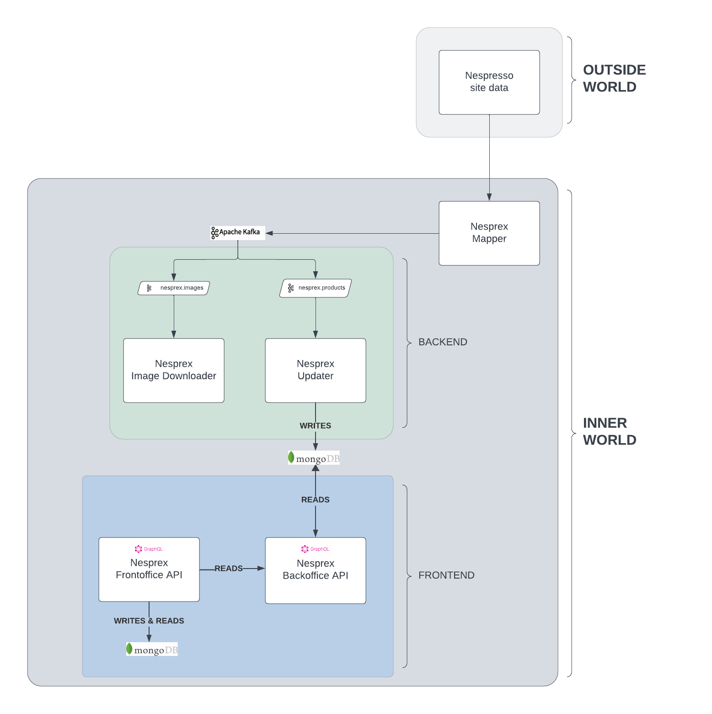

# Nespresso Capsules Inventory System ☕️

Welcome to the Nespresso Capsules Inventory System, an open-source initiative designed for Nespresso coffee enthusiasts to manage and track their capsule inventory efficiently.

## Project Overview 🌟

This project aims to create a user-friendly and intuitive system that simplifies the process of monitoring Nespresso capsule stock. By leveraging modern software practices, it provides an opportunity for beginners to collaborate and learn together while contributing to a practical, real-world solution for managing coffee capsules.

## Features 🚀

- ⚒️ **Comprehensive Inventory Management**: Seamlessly tracks Nespresso capsule quantities, enabling efficient stock control and ensuring constant availability through intuitive management tools.
- ⚒️ **User-Friendly Interface**: Enjoy a simple and intuitive interface for checking stock levels and placing orders.
- 📈 **Community Collaboration**: Engage with a community of coffee lovers and beginners to learn, share insights, and contribute.
- 📈 **Accessible System**: Easy-to-use tools for managing capsules, enabling coffee enthusiasts to enjoy their brews hassle-free.
- 📈 **Capsule Image Recognition**: Utilizes advanced image recognition technology to identify Nespresso capsule types automatically.
- 📈 **In-App Purchases**: Enables users to buy capsules directly through the application for a seamless shopping experience.
- 📈 **Drink Analysis**: Offers insightful analytics on the most and least consumed capsules based on time and temperature data.

### Architecture 🏢

    

## Getting Started 🛠️

To get started with the Nespresso Capsules Inventory System, simply follow these steps:

1. Clone the repository.
2. Set up the required environment as per the provided instructions.
3. Run the system and explore the intuitive interface to manage your Nespresso capsules.
4. Share your experiences and contribute your insights to enhance the project further.

## Contribution Guidelines 🤝

We encourage everyone interested in coffee, technology, or both, to contribute! Whether you're a beginner or an experienced developer, you can help improve the project by:

- **Enhancing User Experience**: Propose UI/UX improvements for a better user journey.
- **Testing and Feedback**: Provide feedback, report issues, and help improve system stability.
- **Sharing Knowledge**: Contribute your insights, experiences, and expertise to benefit the community.

Join us on this journey to create a seamless Nespresso Capsules Inventory System for coffee lovers worldwide!

## Community and Support 🌐

Connect with our community via:

- **Discord**: [Link to Discord server]
- **GitHub Discussions**: Participate in discussions, ask questions, and share ideas.
- **Issue Tracker**: Report bugs, suggest enhancements, or discuss features.

Let's brew happiness together with the Nespresso Capsules Inventory System! ☕️✨
